Telematic Performance Laboratory was a series of three practice-led research laboratories held during 2004–2005 in the 30 × 60 m black-box of Kanonhallen in Copenhagen. The project was run by [Boxiganga](https://teaterleksikon.lex.dk/Boxiganga) — Kjell Yngve Petersen and Karin Søndergaard, both PhD candidates at the Planetary Collegium, University of Plymouth — with Simon Moe and myself as research assistants from the Communication Studies programme at Roskilde University.

The work investigated the relationships between performing and experiencing — between remote, mirrored, virtual and delayed presences — through scenographic installations built from mirrors, cameras, projectors and constructed light-rooms, walked through in a considered sequence by invited participants.

## Method

The laboratories proceed from a working assumption within the Boxiganga tradition: that a sufficiently precise arrangement of bodies, light, media and objects can itself constitute a mode of thinking. A *Performance Research Laboratory*, on this view, is a setting in which fully-built situations function as instruments for analytic experience — situations in which the participant is at once the subject under study and the means of studying. The task is to find ways to articulate what arrives from inside that position.

Practice-led research, in the form the project sought to formalise, is the work of letting practice generate knowledge that cannot be reached otherwise, and then drawing that knowledge into language by attending to the configurations of attention that gave rise to it. The three laboratories were an attempt at this work within a single performance tradition, with an eye to making the procedures legible enough to be transferred.

We saw the minimally staged situations as *situational arguments* about human presence and relationships — each setup a configuration of bodies, light, optics and time-delay holding a single phenomenal question. Nothing in a setup was decorative; the mirrors, screens, cameras and projectors weren't production elements around an underlying performance, they were the situation itself. What a setup did to the person inside it was what the setup meant.

Much of the technical work, which Simon and I carried alongside Kjell and Karin, was a matter of arriving at a restrained and exact form for each configuration: latency right for the delay to read, the edge of a light-room hard enough to read as bounded, projection geometries lined up to within a centimetre so two screens could fuse into one perceived space. The situation only holds within those tolerances.

## The thirteen situations

The thirteen setups developed across the three laboratories are listed below in the order they appear in the project folder, which roughly tracks an increase in phenomenological complexity. The folder PDF in the right-hand column contains the diagrams in full.

<figure class="setup">

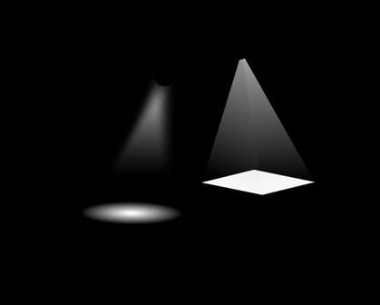

**1. Sharp lightroom and diffuse lightroom** — Two adjacent light-rooms in the same dark space, one a hard-edged rectangle of light, the other a soft circular glow. A single person enters one, then the other; an observer watches from outside.

</figure>

<figure class="setup">

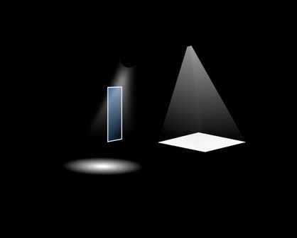

**2. Sharp lightroom and diffuse lightroom with mirror** — The same paired lightrooms, with a large mirror set between them. The participant's gaze and body are split between direct and reflected presence across two qualities of light.

</figure>

<figure class="setup">

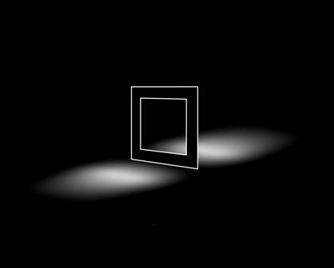

**3. Single frame double lightroom** — A live video frame holds two physically separated lightrooms at once. The participants share a frame but not a room; their bodies occupy a single composed image they cannot themselves see.

</figure>

<figure class="setup">

**4. Video phone** — Two people, two cameras, two screens, live. Address and presence sit at either end of a wire.

</figure>

<figure class="setup">

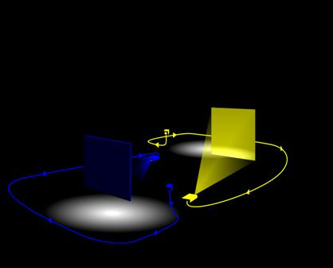

**5. Real you projected me** — A closed-circuit configuration in which I am projected, at scale, on a screen you stand in front of. You see me. I see myself.

</figure>

<figure class="setup">

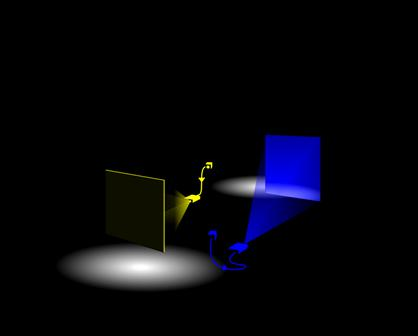

**6. Real you projected you** — The complementary configuration: you stand in front of your own projected image, at scale, while I watch you watching yourself.

</figure>

<figure class="setup">

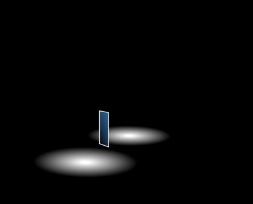

**7. Double lightroom and mirror** — Two lightrooms, with a mirror placed between them. Up to three people occupy the two rooms but appear in a single mirrored composition.

</figure>

<figure class="setup">

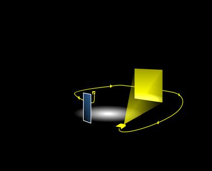

**8. Lightroom with mirror and projection** — A single lightroom containing both a mirror and a live projection of itself. The participant's image is layered three ways: physical, reflected, projected.

</figure>

<figure class="setup">

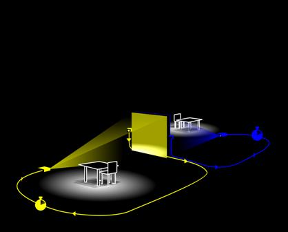

**9. Delay videophone with table and chair** — A video phone in which the return image is delayed by a few seconds. The table and chair work as a fixation mechanism: sitting down brings the two sides into a more visibly similar situation, and with the delay this can collapse into a mirrored symmetric experience of a simultaneous *now*. For some participants this became an active study, working delay-synchronised loops of gesture to collapse the perception of the delay circuit into an experienced simultaneousness. The matched furniture on both sides also makes the locality of the image ambiguous; with the delay, some participants lost track of whether they were watching themselves or the opposite room.

</figure>

<figure class="setup">

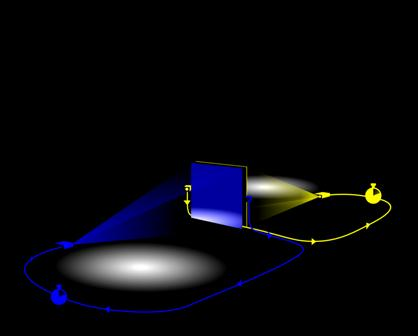

**10. Crossed delay projections for dance** — Four projectors crossed in the space, each carrying a different short delay. A dancer moves inside this lattice of her own immediate pasts.

</figure>

<figure class="setup">

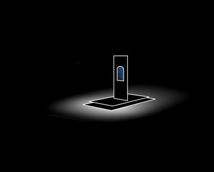

**11. Mirrechophone** — A mirror in combination with a delayed video echo. Optical reflection (instantaneous) and temporal reflection (delayed) co-exist in one composition.

</figure>

<figure class="setup">

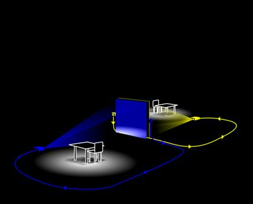

**12. Videophone with table and chair** — The undelayed video phone with the table and chair set up on both sides. Without the delay the situation is straightforwardly recognisable as a video conversation; the matched furniture steadies the configuration rather than confounding it.

</figure>

<figure class="setup">

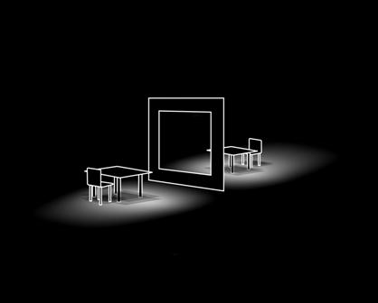

**13. Single frame double lightroom with table and chair** — Two physically separated lightrooms held inside a single video frame, with the table and chair present on both sides. The shared frame and the matching furniture together aid the conflation of the two spaces; for some participants the rooms collapsed entirely into one.

</figure>

## Three laboratories

**Laboratory I — November 2004.** Exploratory work. A small ensemble inhabited the early constructions, and through that inhabitation the situations were discovered and refined — found in what each setup did to the person standing inside it. What Lab II walked through emerged here.

**Laboratory II — February 2005.** Twelve situations built inside the 30 × 60 m space, arranged in a progression of phenomenological complexity and walked through in sequence over six days. The participants were a deliberately interdisciplinary group of scholars: Dan Zahavi (Center for Subjectivity Research, Copenhagen), Mie Buhl, Ingelise Flensborg and Leif Holm (DPU), Katja Bülow, Erik Pold, Sanne Bjerg, Tilde Knudsen, Katrine Karlsen, Michael Thomsen, Stuart Lynch, Kerstin Anderson, Tina Tarpgaard and Pelle Skovmand — from phenomenology, performance studies, psychology, semiotics, philosophy and architectural practice. Each participant inhabited each setup and was interviewed afterwards; the interview corpus remains the project's richest documentary layer.

**Laboratory III — June 2005.** Dramaturgy and composition. Where the first two laboratories treated each situation as a self-contained instrument, Lab III placed them in sequence and let them speak to one another — re-situating the earlier phenomenological work inside performative time. The compositional structures that emerged were close to those of a Boxiganga performance event, with the difference held in the position the participants were asked to take.

## Knowledge formation as performance

The conceptual frame for the project — articulated by Kjell Yngve Petersen in the [PARIP 2005 conference abstract](https://www.bris.ac.uk/parip/parip2005.htm) and later, more formally, by Petersen and Søndergaard in their EKSIG 2011 paper *[Staging Multi-modal Explorative Research using Formalised Techniques of Performing Arts](https://dl.designresearchsociety.org/eksig/eksig2011/researchpapers/12/)* — is that performance laboratories can serve as a meta-methodological structure for generating, articulating and transferring knowledge about performative states of attention. The laboratory is not a stage from which findings are reported back; it is a setting through which lighting, mediation and objects instantiate a particular formation of attention, which then becomes the object of articulation.

The thirteen setups documented here are early instances of that approach. The lighting and projection research that continued at the IT University of Copenhagen and the Royal Danish Academy through the 2010s carries the same line of work forward into other materials.
