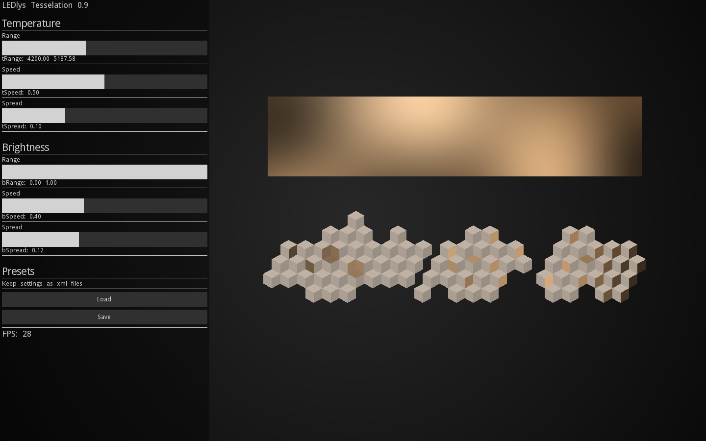
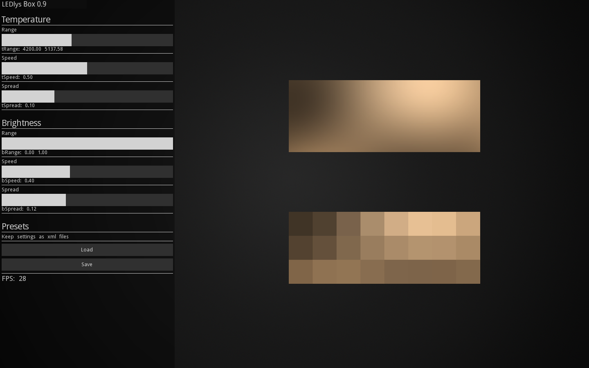
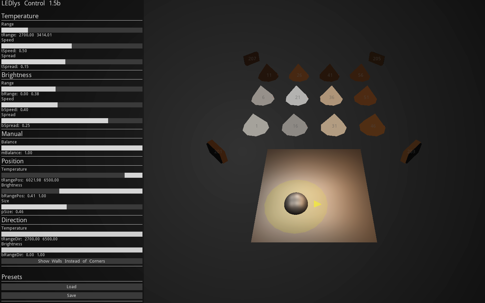

LEDlys ran from 2010 to 2017 across the IT University of Copenhagen and the Royal Danish Academy in Copenhagen, with the question of how artificial light might integrate with the dynamic flux of daylight in architectural space — not as supplementation but as an ambient material continuous with the variations a room receives through its windows.

The project grew directly out of earlier work in performance, especially [Frost](/works/frost/) (2009), where a matrix of modified and frosted cheap LED spots was tied to a Kalman-filtered blob track of the dancer's position to produce a diffuse, position-aware light space that followed a duet softly across the stage. What Frost had shown me was that lighting aesthetics had become a question, not only of designing physical objects, but of composing the temporal dynamics of clusters of light emitters — what the controllers do, and how. LEDlys took that thinking into architectural space, with daylight as the dynamic the artificial light would answer to.

## The premise

Daylight fluctuates dramatically yet remains inconspicuous to the people who inhabit it. We background daylight, but we hold on to the cues it possesses — the time of day, the passing of clouds, the seasons, the changing weather. The premise of the project was that this everyday backgrounding could inform how we formulate the fluctuations of interior LED light: an aesthetic awareness of *backgrounding* and *foregrounding*, of when artificial light remains context, when it moves into attention, when it starts pointing to itself, and when it has become a dominant noise.

If colour temperature and luminous intensity describe the *what* of a light emitter, fluctuations describe the *how*. The project's instruments and software sketches were ways of working in the *how*.

## Three setups

We built three physical setups, each a different arrangement of light emitters running variations of the same control software.

**The Tessellation**, also called the Observational Instrument, was the principal one — a wall-sized array of small acrylic cubes, frosted on each face, with high-CRI tunable-white LED strips embedded behind each surface. Each cube divides the local incoming daylight into three directions — up, towards the light, away from the light — separating a diffuse composite into a readable triplet so that observers can attend to spatial qualities the perceptual constancies would otherwise smooth into one uniform wall. The aim was a structure for experiencing compositions of fluctuating artificial light integrated with the natural variations of daylight.

<figure class="screenshot">

</figure>

**The Wall Box** was the low-resolution counterpart — a traditional flat wall-mounted light box with the same LEDs in an 8 × 3 pixel grid behind an adjustable acrylic diffuser, drawing on the work of Jim Campbell. Sliding the LED backplane closer to the front gave sharp pixels; further away, diffuse ones. The aim was a structure for experiencing traditional diffused arrangements of light pixels in low resolution.

<figure class="screenshot">

</figure>

**Light Follows** was where the Frost lineage came back, in an architectural setting. A small room of translucent fabric walls and a ceiling grid of LED fixtures, with an operator outside the room moving a cursor that tracked a participant's position and orientation. Light around the participant could be shifted in temperature and intensity within the running generative composition; lights could also be made sensitive to the direction the participant faced, or set manually for fine-grained scenes. The aim was a structure for experiencing the emergent qualities of interactive compositions of lightness and darkness.

<figure class="screenshot">

</figure>

Karin Søndergaard and Karina Munkholm Madsen at KADK led the architectural design of the Tessellation. Kjell Yngve Petersen led the research from ITU. I worked across both sides, contributing to the design of the instruments and the light setups across the project as well as writing the software that drove them.

## The Digital Weather

The control software is built around two layered Perlin Noise fields — one for colour temperature, one for luminous intensity — each spatialised across the array so that every light emitter samples its own value from its position in the field. Three controls compose the dynamics: **Range** (how wide the variation), **Speed** (how fast it unfolds), and **Spread**, which is a scale between uniformity and individuality across the cluster. The Speed slider is cubic so its lower end gives extreme slowness; the LED drivers run at 16-bit, more than 65,000 steps, so that the slow intensity shifts are continuous rather than stepped. The whole system is locked to absolute time, which lets any moment be replayed exactly, scaled, or reversed.

What this makes available is a particular kind of slowness. At the low end of the Speed slider, the Perlin field unfolds across the cluster in structured multichannel fluctuations that can be understood as natural phenomena — modulated light from clouds passing the sun, light filtered through leaves in a forest canopy, slow structured changes of light across an open landscape. The tessellation gives the field a body across space; the slowness gives it a body across time. The proposition is that an architectural lighting design need not be a configuration of luminaires: it can be an orchestration of dynamic states across surfaces, made for the perceptual training and perceptual reasoning that engaging with the instruments rehearses.

## Pixel Experiments

Christina Augustesen's *Pixel Experiments* investigated how arrangements of LED pixels might diverge from the industry's evenly distributed rectilinear default — light emitters placed more like sand grains on a beach than points in a grid. Drawing again on Jim Campbell, it explored the border between sparseness and blur, and how the cumulative shadows of clustered emitters give a different quality of blur — escaping the linear steps that evenly spaced grid arrays draw into their shadows.

## Out in the world

Three KADK publications came out of the first phase, all published in 2015: *An Exploration into Integrating Daylight and Artificial Light via an Observational Instrument*; *Adaptivt Lys*; and *Pixel Experiments*. Fourteen architectural lighting designers came through the installation in 2014 across a guided sequence of observations, each spending an hour with the instrument; the 2014 ITU video [*Daylight Adaptation*](https://www.youtube.com/watch?v=iCPGnvG6ChA) follows one of those sessions.

The Digital Weather as a public-facing piece arrived at Vandalorum in 2017 as [Digital Weather](/works/digital-weather/), shown at *Ljus är en rättighet*. The same instrument concept, the same software, made portable for the gallery and given a touchscreen so visitors could compose their own weather across the cube tessellation in the space. The DeSForM 2017 paper *The Experience of Dynamic Lighting*, written with Petersen, sets the design and the reasoning down in detail.

## The Elforsk follow-on

A second phase, 2015 to 2017, took the same thinking out of the laboratory and into networked physical hardware — Adaptive Light Nodes that an end-user could compose relational lighting with directly. That work has its own page: [EAL — Energy Optimization through Adaptive Lighting Control](/research/eal/).

## Behaviours over time

For me, the work belongs to a longer-running interest in how technology behaves over time — and in how the orchestration of dynamic states across multiple devices and locations becomes the main aesthetic and design expression.
