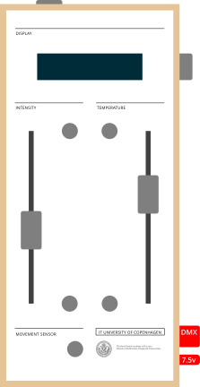

EAL — *Energi­optimering Gennem Adaptiv Lysstyring* (Energy Optimization through Adaptive Lighting Control) — was the Elforsk-funded follow-on to [LEDlys](/research/ledlys/), running 2015 to 2017 under Elforsk grant PSO 347-033, led by Kjell Yngve Petersen at ITU. Where LEDlys settled the question of what dynamic LED light could do alongside daylight, EAL widened the question outward: how do you compose adaptive light across user scenarios, daylight variations and architectural qualities at once, when LED hardware plus IoT infrastructure has opened toward *Lighting-as-a-Service* — buildings whose light is fixed in fixtures but continuously updatable in software?

The work centred on *the adaptive balancing*: a dynamic governance of design parameters that lets light quality be weighed between user needs, daylight ingress and room design. The shift it argues for is from a control paradigm of automation toward a *complex integration of adaptation and negotiation* — many parameters being held in relation at once, none of them fixed.

Karin Søndergaard came in from KADK; Nina Rask joined as PhD researcher; Christina Augustesen contributed across both phases (from Sweco in this one); Sebastian Hølt Bak supported the development at ITU. Industry partners — Spektra LED, Creasign, Sweco, Fagerhult, and Jesper Kongshaug Architectural Lighting — joined around what we framed as an *interdisciplinary ecology*: control software, interface design, fixture design, control infrastructure, architectural room design and user experience taken as one. The project's online home was [lightresearch.dk](http://www.lightresearch.dk); the final report (PSO 347-033) appeared on 30 June 2017 and won Elforsk's Best Research Project award the following year.

## Sketching tools

We built a family of sketching tools for 1:1-scale tests of adaptive lighting in real situations rather than simulations. There were four:

- **The Lightbox** — a backlit box with a translucent acrylic plate at variable distance from the LEDs, where the Digital Weather software composes intensity and colour temperature in dynamic flows alongside the daylight on the wall around it.
- **The Luminous Window-frame** — a deep frame that stages an encounter between daylight and artificial light, working as both daylight aperture and luminaire; the matt translucent acrylic surfaces are backlit by integrated LEDs.
- **The Acrylic Sheets toolkit** — side-lit engraved acrylic plates for studying the LED as an integrated architectural component, varying transparency, reflection and perceived light intensity together.
- **The dynamic white directed light kit** — the kit Jørn Lambertsen and I built — nine purpose-built controllers and a collection of sixteen lamps for composing relations between light-zones across a room.

The Observational Instrument and the *Adaptivt Lys* installation from the [LEDlys](/research/ledlys/) phase stayed in use throughout most of EAL alongside the new sketching tools.

## The dynamic white directed light kit

<figure class="screenshot float-left">

</figure>

I prototyped the controllers — first a tangle of breadboards, RFduinos and motor drivers on cardboard, then a wooden box with a screen and a row of sliders — and Jørn Lambertsen and I refined, built and assembled the finished set of nine together in close collaboration. Each controller carries two **motorized faders** for intensity and colour temperature, two **range knobs** that bracket each fader, a small display, a movement-sensor input, a light-sensor input, and a 5-pin DMX out to its lamps. They connect over Bluetooth into a relational network.

The motors on the faders are quantitative feedback. They drive the sliders to the controller's current output at every moment, so what the controller is doing has a visible scale rather than living invisibly in software. The light in the room is what carries the experience of a composition; the faders just make the numbers underneath legible, and make manual overrides tangible when a channel needs to be reached into and redirected.

The kit pairs the nine controllers with sixteen lamps: four highly-diffusing *context* lamps for ambient light, four high-directional spots with bounded edges, and eight low-directional spots with diffuse boundaries. The diffuse context lamps are individually controllable in intensity and colour temperature; the directional lamps are governed by the controllers.

## An embodied mapping graph

Behind those simple-looking knobs and sliders is the concept I proposed for the kit — and for sketching adaptive lighting in general: a physically embodied networked mapping graph.

Each controller is a node. A node can be *bound* to another controller, or to a sensor — its motion sensor, its light sensor — and the bound source becomes its input. The range knobs are where the embodied part shows itself. They set a minimum and maximum on each channel: intensity from this value to that, temperature from this Kelvin to that. Two knobs together describe a Processing-style `map(input, 0, 1, min, max)`. And because the knobs can be turned past each other, the mapping can also invert. A controller bound to another is therefore a **remapping** of its source, not a copy.

That is enough to grow a tree. A slider movement, a sensor reading, the slow swell of motion detection — anything that lands on one controller cascades down through the bound controllers, each remapping the signal into its own range, each driving its own lamp. The master software visualises the network as a graph and lets us save and recall the entire collective's state as a single composition. The unit of design becomes the *graph*, not the lamp: rather than asking "what should each lamp do?" the question becomes "what relations between lamps will hold, and how will a signal propagate through them?"

This is what made the kit a sketching tool rather than a control desk. A designer in the room could pick up a controller, turn a knob, and watch the consequence ripple through the lamps bound downstream of it — with the motorized faders on each downstream controller showing where in its remapped range the signal had landed. The control paradigm of *adaptation and negotiation across many parameters* became something a person could hold in two hands.

## Software

I wrote the firmware and the software across the project — both the embedded code on the controllers and the master view that the kit and the other instruments shared. The firmware on the controllers runs on RFduinos — Bluetooth-enabled Arduino-class microcontrollers — as [ledSynth](https://github.com/olekristensen/ledSynth). DMX output is handled by a small Arduino i2c-to-DMX adapter board, [ledSynthDmxBoard](https://github.com/olekristensen/ledSynthDmxBoard), so the RFduino can talk DMX to standard fixtures over a familiar protocol. A desktop openFrameworks application, [ledSynthMaster](https://github.com/olekristensen/ledSynthMaster), sits over the network — it holds the graph of *who is bound to whom*, lets us reach in and remap, captures presets, and recalls the whole collective's state. The mapping graph that the kit makes physical lives, on the software side, as a structure the master can walk and serialise.

## Behaviours over time

The kit became the backbone of the laboratory's adaptive lighting sketches — the structure that the experiments hung off, the shared instrument the team and the visiting designers reached for. EAL itself sits partway along a longer arc: beginning with [LEDlys](/research/ledlys/) in 2012, continuing into the pilot installations the report imagined for the years after — a primary school, an office, a low-density housing area, and on toward IoT and Lighting-as-a-Service implementations that buildings could be reshaped around. The kit and the sketching tools are the part that stayed within EAL itself.

For me the work belongs to a longer-running interest that runs through [LEDlys](/research/ledlys/) and earlier pieces like [Frost](/works/frost/): how technology behaves over time, and how the orchestration of dynamic states across multiple devices and locations becomes the main aesthetic and design expression. The embodied mapping graph EAL produced is the version of that thought I held in my hands.
